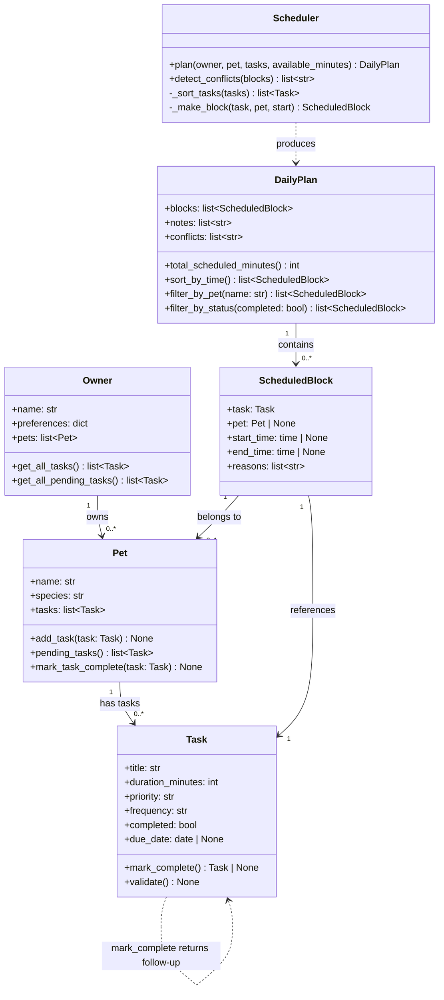

# PawPal+ — Final System Architecture (UML)

Paste the block below into [mermaid.live](https://mermaid.live) to render the diagram,
or view it directly in VS Code with the Mermaid Preview extension.

## Changes from initial design

| Area | Initial | Final |
|------|---------|-------|
| `Task` fields | title, duration, priority | + `frequency`, `completed`, `due_date` |
| `Task` methods | `validate()` | + `mark_complete()` returning a follow-up Task |
| `Pet` methods | `add_task()`, `pending_tasks()` | + `mark_task_complete()` for recurrence |
| `ScheduledBlock` | task, start, end, reasons | + `pet` field for multi-pet filtering |
| `DailyPlan` | blocks, notes, `total_scheduled_minutes()` | + `conflicts` list, `sort_by_time()`, `filter_by_pet()`, `filter_by_status()` |
| `Scheduler` | `plan()`, `_sort_tasks()`, `_make_block()` | + `detect_conflicts()` |
